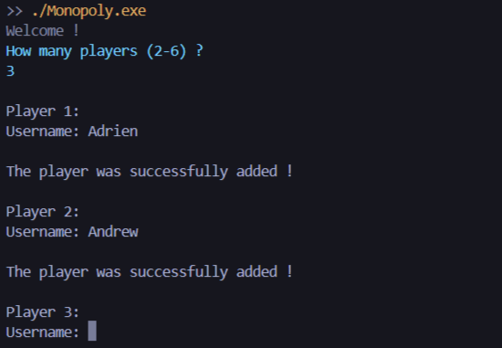
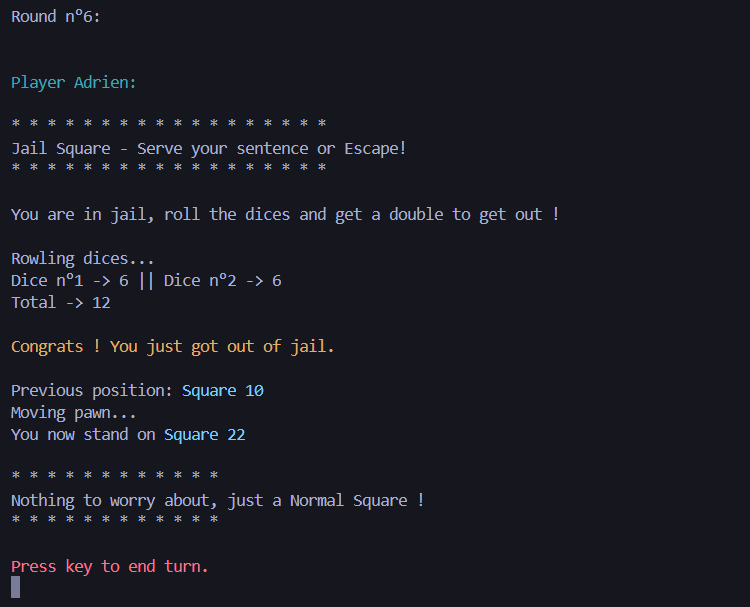

# **C# Monopoly**

C# Monopoly is a school project that simulates the classic board game Monopoly, developed using C# and targeting the .NET Framework. This project serves as an example of object-oriented programming principles, showcasing encapsulation, inheritance, and polymorphism through its class design and interactions.

## **Features**

- Game Logic
- Board Representation
- Player Management
- Dice Mechanics

## **Usage**

```shell
cd Monopoly/bin/Debug
./Monopoly.exe
```

## **Snapshots**



